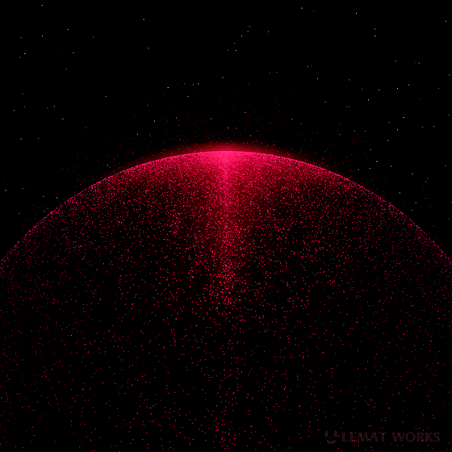
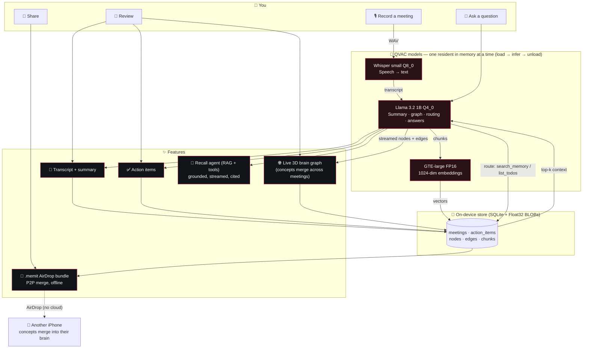

<div align="center">


# mem-it

**A private "second brain" as your conversational knowledge engine that runs entirely on your iPhone.**

Record · transcribe · build a knowledge graph · ask it anything — with zero cloud and nothing ever leaving the device.



[Demo video](https://canva.link/ea5wy6e447bajjm) · [Submission](SUBMISSION.md) · [Hardware](HARDWARE.md) · [App docs](cortex/README.md) · [Build in public](BUILD_IN_PUBLIC.md)

</div>

---

## What it is

mem-it records a meeting and, fully on-device via Tether's [`@qvac/sdk`](https://www.npmjs.com/package/@qvac/sdk), transcribes it (Whisper), extracts a knowledge graph + action items + a summary (Llama 3.2 1B), embeds it for retrieval (GTE-large), and grows a live 3D "brain graph" where the same concept merges across meetings.

**Recall** is a small on-device agent that tool-calls between your transcripts and your action items, then answers with streaming citations. It's hardened against prompt injection, and you can AirDrop a meeting to another iPhone where it merges into *their* brain — peer-to-peer, offline, no server.

Put the phone in airplane mode and it still works.

## Why it matters

Your meetings are your most sensitive data — strategy, salaries, deals, health. Every cloud notetaker uploads all of it. mem-it proves you don't have to: a flagship phone can transcribe, reason over, and recall your conversations with **no network dependency at all**.

## What's novel

- **On-device agent, not just RAG** — Recall routes between tools (`search_memory` over transcripts, `list_todos` over the action-items table), then answers grounded in the result, streaming token-by-token with citations. Tool calling on a 1B model, on a phone.
- **Live 3D knowledge graph** — entities stream into a force-directed 3D graph as the model generates them, and the same concept merges across meetings by similarity (cosine, threshold 0.82).
- **Prompt-injection hardened** — transcripts/context are untrusted; that text is fenced as data with an instruction hierarchy and forged markers are stripped, so it's never obeyed.
- **AirDrop a memory (P2P, offline)** — export a meeting as a portable `.memit` bundle (with chunk embeddings + graph subgraph) and AirDrop it; it merges into a teammate's brain graph and RAG index by label. No cloud.
- **Strict memory discipline** — exactly one QVAC model resident at a time (load → infer → unload), with every load/unload, TTFT, and tokens/sec logged.

## Pipeline

```
record (WAV) → Whisper STT → unload
            → Llama 3.2 1B → summary + action items, then streamed {nodes, edges} → unload
            → GTE embeddings → transcript-chunk vectors → unload
            → SQLite (meetings, action_items, nodes, edges, chunks)

Recall: Llama (route) → tool (search_memory | list_todos) → Llama (answer, streamed)
Share:  meeting → .memit bundle → AirDrop → import-merge into recipient's graph + RAG
```

### How it all fits together

Architecture cum user-flow: what you do, which model runs (one at a time, on-device), and the feature it powers.



Exactly one QVAC model is resident at a time. Embeddings are stored as Float32 BLOBs and cosine similarity is computed in JS (no vector DB). The 3D graph is `3d-force-graph`/three.js hosted in a WebView.

**Models:** `WHISPER_SMALL_Q8_0` (STT) · `LLAMA_3_2_1B_INST_Q4_0` (LLM) · `GTE_LARGE_FP16` (embeddings, 1024-dim).

## Quick start

The app lives in [`cortex/`](cortex/) (Expo SDK 56 / React Native 0.85). A real device is required — QVAC needs real hardware (iPhone 14 Pro, A16, iOS 16.4+).

```bash
cd cortex
npm install
npx expo install expo-audio expo-sqlite react-native-webview expo-sharing expo-document-picker
npm run bundle:graph
npm run ios            # real device required
npm test               # unit tests, no device needed
```

First launch downloads the three QVAC models, then runs fully offline. A structured performance log (`memit-perf-*.json`) is written to the app document directory after each recording.

See [`cortex/README.md`](cortex/README.md) for architecture details and [`cortex/CLAUDE.md`](cortex/CLAUDE.md) for the development guide.

## Repository layout

| Path | What |
|---|---|
| [`cortex/`](cortex/) | The mem-it app — Expo / React Native source, QVAC wrappers, pipeline, 3D graph, RAG, P2P sharing |
| [`SUBMISSION.md`](SUBMISSION.md) | QVAC hackathon submission writeup |
| [`HARDWARE.md`](HARDWARE.md) | Demo device specs + evidence checklist |
| [`API_DISCLOSURE.json`](API_DISCLOSURE.json) | Network/API disclosure (no cloud AI) |
| [`BUILD_IN_PUBLIC.md`](BUILD_IN_PUBLIC.md) | Build-in-public log |
| [`demo-script.md`](demo-script.md) | Demo walkthrough |
| `docs/` | Plans and design specs |

## Hardware

iPhone 14 Pro (`iPhone15,2`), A16 Bionic, 6 GB RAM, iOS 26.5 (build 23F77). 100% on-device inference — see [`HARDWARE.md`](HARDWARE.md).

## Track

**Mobile** — retail iPhone 14 Pro, 100% on-device inference through `@qvac/sdk`. No API keys, no accounts, no network after the initial model download. Judges can verify the offline claim by enabling airplane mode and running a full record → recall flow.

## License

[Apache 2.0](LICENSE).
